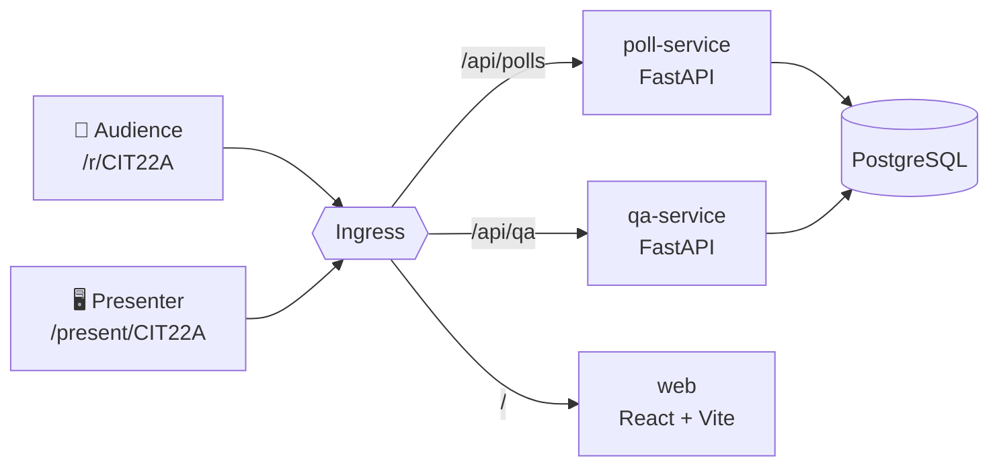

# Build Smarter

You are going to take a working app called **Pulse** — live audience polls, the kind
you have voted in at a conference — and add a real feature to it **on stage, with a
coding agent**, then watch it deploy itself.

By the end you will have done the whole loop:

> write a spec → let an agent implement it → **review what it actually did** →
> merge → watch GitOps roll it out

The reviewing step is the one that matters. Everything else is plumbing you can learn
once. Knowing what to look for in code you did not type is the durable skill.

## What Pulse is

Three screens over two small APIs and one database:

`poll-service` is finished. `qa-service` answers exactly one endpoint — `/healthz` —
and nothing else. **That gap is the exercise.**

:::info[Why this matters]
`qa-service` already exists on `main` as a deployed hello-world, with its Dockerfile,
CI job, Kubernetes manifest and ingress route in place. So when the agent writes the
Q&A feature, it writes *feature logic only* — no plumbing, no new infrastructure.

That is a deliberate setup choice, and it is most of why a live build can finish in
fifteen minutes instead of failing in forty. Give an agent a narrow, well-fenced hole
to fill and it does well. Ask it to invent your architecture live and it will not.
:::

## How to read this

Every page answers **what to type** and **why it is that way**. If you only want it
running, follow the commands. If you want to actually learn something, read the
callouts — that is where the reasoning lives.

  <a className="card-link" href="/setup">
    
STEP 1

    
Set up your machine

    
One command. Then we pull it apart and look at what it did to your laptop.

  </a>
  <a className="card-link" href="/tour">
    
STEP 2

    
Tour the app

    
Vote from your phone. Watch the presenter chart move. Find the missing feature.

  </a>
  <a className="card-link" href="/concepts/polling">
    
STEP 3

    
Why it is built this way

    
Four decisions with real trade-offs — including two that look wrong until you hear the reason.

  </a>
  <a className="card-link" href="/kubernetes/containers">
    
STEP 4

    
Ship it

    
Containers, a local Kubernetes cluster, and a commit that deploys itself.

  </a>
  <a className="card-link" href="/agentic/rules">
    
STEP 5

    
Agentic engineering

    
Constrain the agent, hand it a spec, build the feature, then review it properly.

  </a>
  <a className="card-link" href="/reference/commands">
    
REFERENCE

    
Every command

    
The full list, plus what to do when something breaks.

  </a>

## What you need

| Thing | Why | Required? |
| --- | --- | --- |
| Node 18.18+ | Runs the tooling and the web app | Yes |
| Git | You are going to commit things | Yes |
| Docker Desktop | PostgreSQL, container images, the cluster | Yes for the Kubernetes parts |
| A coding agent | Cursor, Claude Code, Copilot — any agent mode | For step 5 |
| Python | **Not needed.** Setup downloads its own. | No |

That last row is not a typo. `npm run setup` fetches a managed CPython 3.12 into the
project and never touches your system Python. If you have Python 3.8 from years ago,
it stays exactly where it is.

## If you are using a coding agent to follow along

That is encouraged — it is the point of the session. Two things make it work better:

1. **Point your agent at `AGENTS.md` in the repo root first.** It states the stack, the
   test commands, and the rules. Agents follow a written constraint far more reliably
   than a remembered one.
2. **Ask for a test with every change.** "Add the rate limit" gets you a rate limit.
   "Add the rate limit and a test for it" gets you both, and the test is how you check
   the first part is real.

---

Ready? **[Set up your machine →](/setup)**
