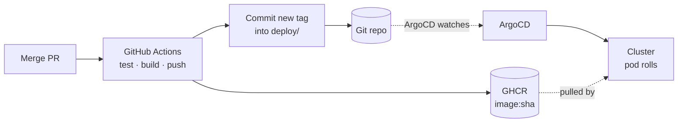

# GitOps

One sentence: **the repository is the desired state, and something in the cluster
continuously makes reality match it.**

You do not deploy. You commit, and the cluster catches up.



Note which arrow is missing: there is no arrow from a laptop to the cluster.

## The Application

```yaml
# deploy/argocd/app.yaml
spec:
  source:
    repoURL: https://github.com/Naveen-oops/pulse.git
    targetRevision: main
    path: deploy/overlays/demo

  syncPolicy:
    automated:
      selfHeal: true
      prune: true
```

Those two flags are the whole idea.

**`selfHeal: true`** — if someone edits the cluster by hand, ArgoCD reverts it. Scale a
deployment with `kubectl scale` and it scales back. The repo wins, always.

**`prune: true`** — delete a manifest from the repo and the object is deleted from the
cluster. Without this, removed things linger indefinitely and drift accumulates.

:::info[Why this matters]
The real value is not automation, it is **auditability**.

Because every change to the cluster arrives as a commit, `git log deploy/` is a complete
deployment history: what changed, when, by whom, and with a revert button. No
screen-sharing to find out who scaled what at 2am.

And recovery becomes ordinary. Lost the cluster? Recreate it, point ArgoCD at the repo,
and it rebuilds to the last known good state. The cluster stops being precious.

The cost is real: every change needs a commit, which is slower than `kubectl edit`, and
`kubectl edit` no longer works — `selfHeal` undoes it. That feels obstructive for about a
week and then feels like a seatbelt.
:::

## The commit that deploys

The clever part is in CI. After pushing the image, it edits the overlay:

```yaml
# .github/workflows/ci.yml
- name: Point the demo overlay at the new images
  working-directory: deploy/overlays/demo
  run: |
    for pkg in poll-service qa-service web; do
      kustomize edit set image \
        "pulse/${pkg}=${REGISTRY}/${OWNER}/pulse-${pkg}:${SHA}"
    done

- name: Commit the deploy
  run: |
    git commit -m "deploy: ${GITHUB_SHA::7} [skip ci]"
    git push
```

That is the hinge. CI does not talk to the cluster — it does not have credentials and does
not need them. It writes a commit that says "this is the image now", and ArgoCD notices.

```diff
 images:
   - name: pulse/poll-service
-    newTag: 8f2a1c9
+    newTag: 3d7e4b2
```

That diff **is** the deployment. It is reviewable, revertible, and it explains itself.

:::tip[`[skip ci]` is not optional]
CI commits to the repo that triggers CI. Without `[skip ci]` you have an infinite loop:
push → build → commit → push → build…

Note also that commits made with `GITHUB_TOKEN` deliberately do not trigger other
workflows, which is a second layer of protection. If you swap to a personal access token
to get cross-workflow triggers, `[skip ci]` becomes the only thing standing between you
and a very expensive Tuesday.
:::

## Install it

```bash
npm run cluster:argocd
```

Installs ArgoCD, waits for it, then applies the Application with the repo URL
substituted from your actual git remote — so the committed manifest never carries a
stale placeholder.

Then open the UI:

```bash
kubectl -n argocd port-forward svc/argocd-server 8090:443
```

Username `admin`; the password is printed by the script. You get a live dependency graph
of everything ArgoCD manages, with sync status and diffs.

:::warning[ArgoCD needs a git remote — it cannot watch your laptop]
If the repo has no remote, the install succeeds and the Application does not:

```
⚠️  No git remote yet — ArgoCD cannot sync from a repo that is not pushed
```

This is not a bug in the script. ArgoCD polls a **git URL**. It has no access to your
working directory and no way to see an unpushed commit. A local-only repo cannot
participate in GitOps, by definition.

Push to GitHub first, then run it again.
:::

## Seeing self-heal work

The demo that makes it land — delete a running pod and watch it come back, then do
something ArgoCD actually cares about:

```bash
# scale to zero by hand
kubectl -n pulse scale deployment/web --replicas=0

# watch ArgoCD notice and put it back
kubectl -n pulse get deployment/web -w
```

Nobody typed a fix. The repo said one replica, so there is one replica.

---

**[The CI pipeline →](/kubernetes/ci)**
